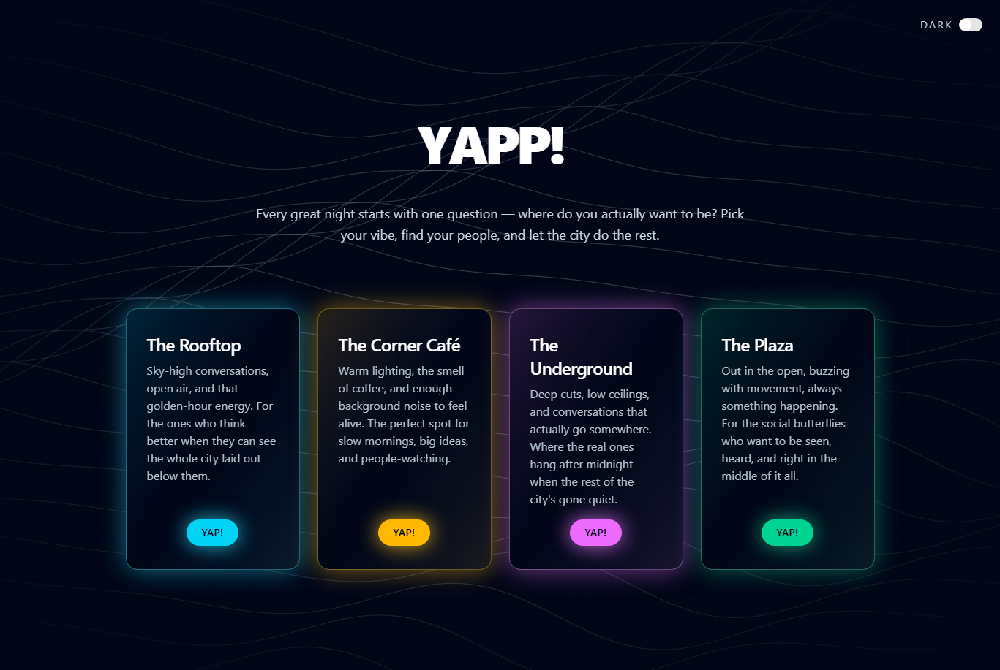

# YAPP

`Yapp` is a full-stack real-time chat app with a Bun + WebSocket backend and a Vite frontend.  

## Priview 

## Live demo

Currently live at -  [yapp.curr.xyz](https://yapp.curr.xyz)

## Preview



## Features

- Real-time chat over WebSockets
- Multi-room chat experience (Rooftop, Café, Underground, Plaza)
- User profile with names
- Basic backend hardening (origin checks, message validation, rate limiting)
- Automatic room timeout notifications for inactive rooms

## Local setup

### 1) Clone the project

```bash
git clone <your-repo-url>
cd chat-ws
```

### 2) Setup and run backend

```bash
cd be
bun install

# Start backend (dev with reload)
bun run dev
```

Backend runs on `ws://localhost:8080` by default.

### 3) Setup and run frontend (new terminal)

```bash
cd fe
npm install
npm run dev
```

Frontend runs on `http://localhost:5173` by default.

### 4) Open the app

- Frontend: `http://localhost:5173`
- Backend WebSocket: `ws://localhost:8080`

## Environment variables

### Backend (`be`)

- `PORT` (default: `8080`)
- `ALLOWED_ORIGINS` (optional, comma-separated list)
- `WS_MESSAGES_PER_SECOND` (optional, default: `5`)

### Frontend (`fe`)

- `VITE_WEBSOCKET_URL` (optional, default: `ws://localhost:8080`)

## Run backend with Docker (optional)

```bash
cd be
docker compose up --build
```

This exposes the backend on `ws://localhost:8080`.
